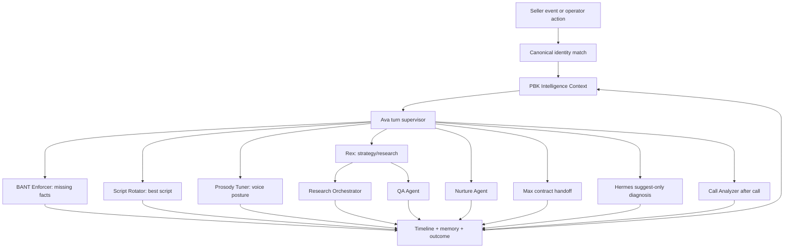

# Agent Handoff

Agent handoff is how PBK turns one seller event into coordinated work across the
fleet without losing context or bypassing safety.

## Handoff Rule

Every handoff should carry PBK Intelligence Context and write back an auditable
result. Handoffs are not side conversations between agents; they are structured
events.



## Handoff Payload

```json
{
  "handoffId": "string",
  "fromAgent": "ava",
  "toAgent": "script-rotator",
  "reason": "price_objection",
  "leadId": "string",
  "threadId": "string|null",
  "callId": "string|null",
  "context": "PBKIntelligenceContext",
  "requestedAction": "select_objection_script",
  "allowedTools": ["selectContextAwareScript"],
  "risk": "low|medium|high",
  "requiresApproval": false
}
```

## Common Handoffs

| From     | To                    | Trigger                               | Expected Result                             |
| -------- | --------------------- | ------------------------------------- | ------------------------------------------- |
| Ava      | BANT Enforcer         | Missing authority/timeline/need       | One next qualification question.            |
| Ava      | Script Rotator        | Objection detected                    | Context-aware script and rationale.         |
| Ava      | Prosody Tuner         | Fear, anger, sadness, urgency         | Voice profile and prohibited actions.       |
| Ava      | Rex                   | Strategy or market context needed     | Recommendation, not provider write.         |
| Rex      | Research Orchestrator | Research task needed                  | Guarded research plan/result.               |
| Ava      | Nurture Agent         | No close but follow-up needed         | Compliant follow-up recommendation.         |
| Ava      | Max                   | Verbal agreement or contract path     | Offer recap/contract handoff with approval. |
| Any      | QA Agent              | Unknown provider result or stale data | Pass/fail/reconcile event.                  |
| Call end | Call Analyzer         | Completed call                        | Summary, score, failure tags, outcomes.     |

## Safety

- Provider actions remain gated even when a handoff recommends them.
- Suggest-only agents cannot execute provider writes.
- If context is stale, the handoff must say so.
- If a provider proof is missing, QA must mark reconcile required.

Related tests:

- `npm run test:agent-fleet`
- `npm run test:agent-context-safety`
- `npm run test:ava-intelligence-unison`
- `npm run test:provider-action-dispatch`
