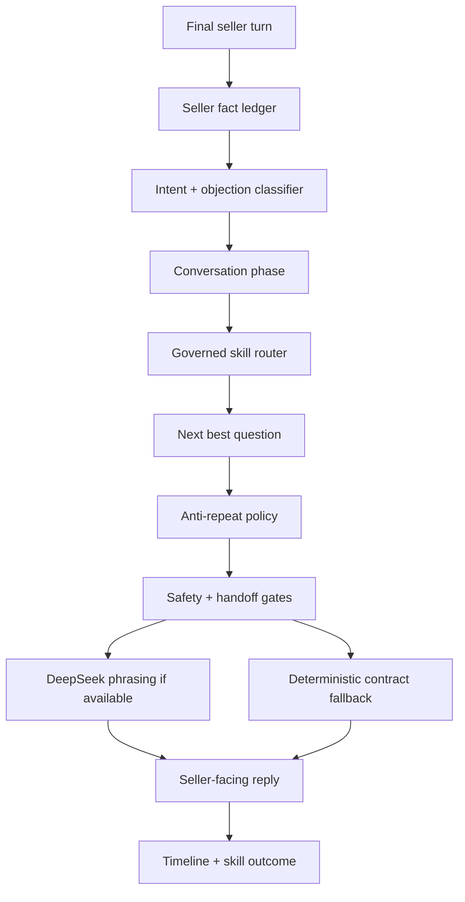

# Ava Turn Contract

The Ava Turn Contract is the deterministic decision object that runs before Ava
speaks on a live call or drafts a seller message. DeepSeek may phrase a reply,
but the contract decides what Ava is allowed to mean.

## Why It Exists

Live calls fail when an LLM responds to partial speech, repeats old questions,
misses a stated price, or forgets the seller's emotion. The turn contract fixes
that by making the call brain deterministic before language generation.

## Contract Fields



| Field              | Purpose                                                     |
| ------------------ | ----------------------------------------------------------- |
| `sellerTurn`       | Final seller utterance being answered.                      |
| `intent`           | What the seller is trying to do or ask.                     |
| `objection`        | Canonical objection class, if present.                      |
| `phase`            | Current closing phase.                                      |
| `knownFacts`       | Price, address, condition, timeline, authority, pain, path. |
| `missingFacts`     | Facts Ava still needs to proceed.                           |
| `lastQuestion`     | Most recent question Ava asked.                             |
| `forbiddenRepeats` | Question categories Ava may not ask again now.              |
| `activeSkill`      | Approved governed skill selected for this trigger.          |
| `nextBestQuestion` | One useful next question or handoff instruction.            |
| `allowedTools`     | Tools that can be used in the current risk state.           |
| `handoffNeeded`    | Whether Ava should pause and route to a human.              |
| `replyMode`        | DeepSeek, deterministic, fallback, or operator.             |

## Intent And Objection Classes

The contract should recognize at least:

- make me an offer
- already gave price
- seller target price
- price too low
- need to think
- spouse or partner decides
- trust or scam concern
- competing offer
- stop repeating
- wants speed
- wants maximum net
- probate/legal/title concern
- caller is an agent
- repairs or condition concern
- DNC or stop-contact request

## Fact Ledger Rules

- Never ask for a BANT field already answered.
- Never ask for price again if seller target price is known.
- Never ask for address again if a usable full or partial address exists.
- Never ask authority again if decision authority is confirmed.
- Never repeat the same question category within three turns.
- If the seller says Ava is repeating herself, apologize and move forward.

## LLM Boundary

DeepSeek can:

- make the response sound natural
- soften tone for emotion
- compress wording for phone latency
- adapt phrasing to seller language

DeepSeek cannot:

- change the next required fact
- ignore forbidden repeats
- invent offer math
- bypass approval
- answer from stale data without a label
- claim a provider action succeeded before proof exists

## Fallback Behavior

If DeepSeek times out or returns empty, Ava must use the deterministic contract
fallback. The fallback must be:

- context-aware
- one or two sentences
- one question at most
- traceable in activity logs
- never the old generic "Coached Ava" prompt

## Example

Seller says: "I already told you I want 300k."

Expected contract:

```json
{
  "intent": "stated_target_price",
  "objection": "already_gave_price",
  "knownFacts": { "sellerTargetPrice": 300000 },
  "forbiddenRepeats": ["price_question"],
  "nextBestQuestion": "You are right, I have 300k. What kind of condition is the property in right now?"
}
```

Related files:

- `scripts/ava-live-turn-contract.mjs`
- `scripts/ava-live-skill-fallback.mjs`
- `scripts/ava-governed-skill-router.mjs`
- `scripts/negotiation-policy.mjs`
- `docs/agents/ava/conversation-state-machine.md`

Verification:

- `npm run test:ava-live-turn-contract`
- `npm run test:ava-governed-skill-router`
- `npm run test:ava-intelligence-unison`
- `npm run test:production-hardening`
