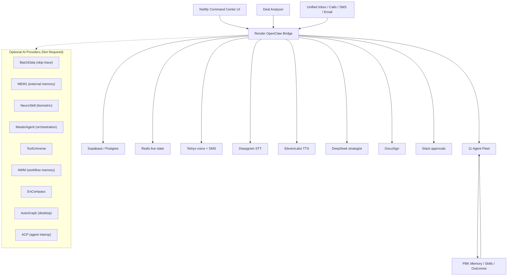

# PBK Production Architecture

This is the high-level production map for PBK. Use it in runbooks, operator
onboarding, investor materials, and architecture reviews when you need to
separate required production dependencies from optional future provider slots.



## Core Path

Solid lines are required for production behavior:

- Netlify hosts the Command Center UI.
- Deal Analyzer and Unified Inbox submit actions through the Render OpenClaw
  Bridge.
- The bridge is the single orchestration surface for data, agents, tools,
  provider actions, and safety gates.
- Supabase/Postgres is durable state.
- Redis is live transient state.
- Telnyx, Deepgram, ElevenLabs, DeepSeek, DocuSign, and Slack are provider
  dependencies for live calls, contracts, approvals, and communications.
- The 11 Agent Fleet uses PBK Memory, governed skills, and recorded outcomes as
  a closed learning loop.

## Optional Provider Path

Dotted lines are optional expansion slots. They are not launch blockers and must
not bypass the bridge. Before any optional provider can affect production, it
must have:

- explicit readiness in `GET /api/tooling/status` or production maturity output
- source labels that show live, stale, fallback, or disabled state
- provider timeouts and failure labels
- approval/compliance gates for any external action
- tests proving the provider does not replace the canonical bridge path

## Source Of Truth

The bridge remains the source of truth for runtime decisions. The browser should
not call providers directly for production actions. If a dependency is degraded,
PBK should label the fallback, record the incident, and block high-stakes actions
when the source is not trustworthy.

## Verification

Use these checks when validating the architecture after a deploy:

```bash
curl -s https://pbk-openclaw-bridge.onrender.com/health
curl -s https://pbk-openclaw-bridge.onrender.com/api/production/maturity
curl -s https://pbk-openclaw-bridge.onrender.com/api/system/source-labels
curl -s https://pbk-openclaw-bridge.onrender.com/api/agents/health
npm run test:production-hardening
```

Expected result: core providers are ready or honestly degraded, source labels do
not hide fallback state, and optional providers are clearly marked as optional.
